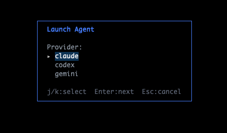
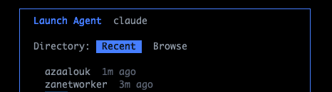
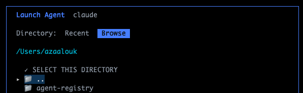
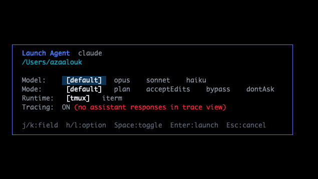

<p align="center">
  
  <br>
  <strong>aimux</strong><br>
  <sub>Tame the agent sprawl.</sub>
  <br><br>
  <sub>See all your agents. Trace what they did. Judge if it was good.</sub>
</p>

<p align="center">
  <a href="https://github.com/zanetworker/aimux/releases/latest"></a>
  
  
</p>

<p align="center">
  
</p>

You're running 5 agents across 3 projects. One just edited 47 files. Was it right? Every other tool tells you which agents are running. aimux tells you what they actually did, and whether it was good.

**Three differentiators:**

- **Trace**: Turn-by-turn view of prompts, responses, and tool calls. Live streaming as agents work.
- **Annotate**: Label turns GOOD, BAD, or WASTE. Add notes. Build eval datasets.
- **Export**: OTEL to MLflow or Jaeger. JSONL to disk. Annotations become feedback assessments.

## Install

```bash
# Homebrew (macOS/Linux)
brew install zanetworker/aimux/aimux

# From source
git clone https://github.com/zanetworker/aimux.git
cd aimux
make install       # builds and copies to /usr/local/bin
```

Then run:
```bash
aimux            # launch the TUI
aimux --version  # check installed version
```

Requires **tmux** for split-pane session embedding.

## Features

### Discovery

Auto-finds running Claude, Codex, and Gemini processes. Status, model, tokens, cost, branch. Refreshes every 2s with instant detection via filesystem watchers.

### Split View

Press `Enter` on any agent to open **trace + session** side by side. Live trace on the left, interactive session on the right. Direct PTY for Claude, tmux mirror for Codex/Gemini.

<p align="center">
  
</p>

### Cost Tracking

Per-agent and per-turn cost with model-aware pricing. Toggle with `$`.

<p align="center">
  
</p>

### Diff Summary

See what files each agent changed. Press `d` for full scrollable diff.

### Live Trace Streaming

Traces update in real-time as agents work via JSONL file tailing.

### Cross-Session Search

Press `/` to search across all agents' traces. "Which agent edited auth.go?"

### Smart Notifications

Attention counter in header. Terminal bell on permission prompts, completion, errors. Per-event config.

### Agent Launcher

Press `:new` to spawn agents. Pick provider, directory, model, mode.

<p align="center">
  
  
</p>
<p align="center">
  
  
</p>

## Keybindings

| Key | Action |
|-----|--------|
| Enter | Open split view (trace + session) |
| / | Search across agent traces |
| $ | Toggle cost-per-turn |
| d | Toggle diff view |
| s | Sort agents |
| m | Mute notifications |
| g/b/w | Annotate turn (good/bad/waste) |
| e | Export trace (j=JSONL, o=OTEL) |
| :new | Launch new agent |
| ? | Help |

## Configuration

`~/.aimux/config.yaml`. All settings optional. See [docs/configuration.md](docs/configuration.md) for full reference.

```yaml
providers:
  claude:
    enabled: true
  codex:
    enabled: true
  gemini:
    enabled: false

export:
  endpoint: "localhost:5001"
  insecure: true
  mlflow:
    experiment_id: "1"
```

## Architecture

**Provider interface**: Add a new agent type in one Go file. See [docs/adding-a-provider.md](docs/adding-a-provider.md).

**Core packages are UI-agnostic**: Supports future web UI. Everything under `internal/` except `tui/` has zero Bubble Tea dependencies.

**OTEL dual-mode**: File parsing for display (full responses). Live receiver on port 4318 for export. Claude Code sends events via OTEL logs protocol.

## Releasing

Releases are fully automated via CI. To cut a new release:

```bash
git tag v0.5.0
git push origin v0.5.0
```

This triggers the [Release workflow](.github/workflows/release.yml) which:
1. Runs the full test suite (build, vet, test)
2. Cross-compiles binaries for darwin/linux (amd64/arm64) via [GoReleaser](.goreleaser.yml)
3. Creates a GitHub release with changelog and binaries
4. Updates the [Homebrew tap](https://github.com/zanetworker/homebrew-aimux) formula

Users then upgrade with `brew upgrade zanetworker/aimux/aimux`.

**Do not run `goreleaser` locally** — let CI handle it to avoid duplicate asset conflicts.

## Built With

[Bubble Tea](https://github.com/charmbracelet/bubbletea) |
[Lip Gloss](https://github.com/charmbracelet/lipgloss) |
[charmbracelet/x/vt](https://github.com/charmbracelet/x) |
[creack/pty](https://github.com/creack/pty) |
[OpenTelemetry](https://opentelemetry.io/)

## License

[MIT](LICENSE)
