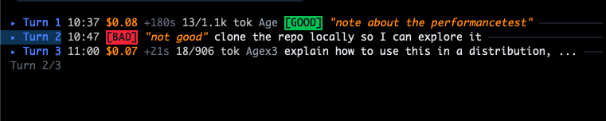
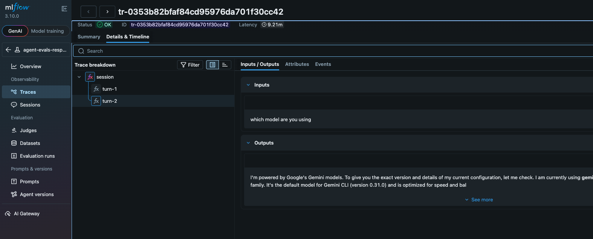
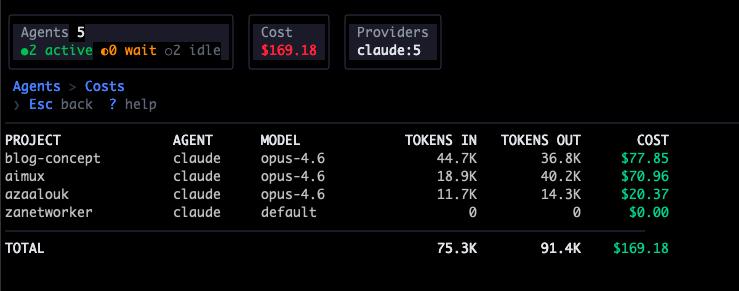
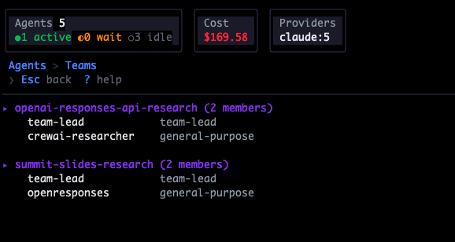

<p align="center">
  
  <br>
  <strong>aimux</strong><br>
  <sub>Multiplex your AI agents. Trace, launch, export. Never leave the terminal.</sub>
</p>

<p align="center">
  <a href="https://github.com/zanetworker/aimux/releases/latest"></a>
  
  
</p>

<p align="center">
  
</p>

You're running 5 agents across 3 projects. Claude is refactoring auth. Codex is writing tests. A third session is idle, or stuck on a permission prompt? You don't know, because each lives in its own terminal.

**aimux is your control plane.** One terminal. Every agent. Full visibility.

- **See everything**: all agents, their status, model, cost, and project in one view
- **Trace what happened**: every prompt, response, and tool call, turn by turn
- **Launch from here**: spawn Claude, Codex, or Gemini without leaving the terminal
- **Annotate, label, and export**: mark turns GOOD/BAD/WASTE, export to MLflow for eval datasets
- **Bring your own agent**: pluggable provider interface, add a new agent in one Go file

## Install

```bash
# Homebrew (macOS/Linux)
brew install zanetworker/aimux/aimux

# From source
git clone https://github.com/zanetworker/aimux.git
cd aimux
make install       # builds and copies to /usr/local/bin
```

Then run:
```bash
aimux            # launch the TUI
aimux --version  # check installed version
```

Requires **tmux** for split-pane session embedding.

## Features

### Discovery

Auto-finds running Claude, Codex, and Gemini processes. Shows status, model, tokens, cost, git branch, and permission mode. Refreshes every 2s. Multiple sessions in the same project directory appear as separate entries with `#1`, `#2` suffixes. Sort by name, cost, age, model, or PID with `s`.

### Split View

Press `Enter` on any agent to open **trace + session** side by side. Live trace on the left, interactive session on the right. Claude uses direct PTY embedding, Codex and Gemini use tmux mirror.

### Conversation Trace

Full turn-by-turn view of prompts, responses, and tool calls:

```
 17:32 USER  fix the authentication bug in login.go
 17:32 ASST  I'll look at the login.go file...
 17:32 TOOL  Read /src/auth/login.go
 17:32 TOOL  Edit /src/auth/login.go   [BAD] "deleted wrong file"
```

### Annotations

Label turns as **GOOD**, **BAD**, or **WASTE** while watching agents work. Add free-text notes. Annotations persist to disk and export with traces.

<p align="center">
  
</p>

### Export to MLflow

Press `e` in the trace pane to export:
- **`j`** JSONL to `~/.aimux/exports/`
- **`o`** OTLP to MLflow, Jaeger, or any OTEL backend

Annotations become MLflow feedback assessments for building eval datasets.

<p align="center">
  
</p>

### Agent Launcher

Press `:new` to spawn agents. Pick provider, model, mode, and project directory. Launches into tmux with OTEL telemetry enabled.

### Cost Dashboard

Press `c` from the agent list for aggregated token usage and estimated USD spend per project:

<p align="center">
  
</p>

### OTEL Receiver

Built-in OTLP/HTTP receiver on port 4318 collects live telemetry from spawned agents. Debug anytime: `curl http://localhost:4318/debug`

### Teams

Press `T` from the agent list to view Claude Code team configurations and members.

<p align="center">
  
</p>

## Key Bindings

| Key | Where | Action |
|-----|-------|--------|
| `j`/`k` | Everywhere | Navigate up/down |
| `Enter` | Agent list | Split view (trace + session) |
| `t` | Agent list | Standalone trace view |
| `c` | Agent list | Cost dashboard |
| `T` | Agent list | Teams overview |
| `Tab` | Split view | Switch focus between panes |
| `e` | Trace pane | Export menu (`j`:JSONL, `o`:OTEL) |
| `a` | Trace pane | Annotate turn (GOOD/BAD/WASTE) |
| `N` | Trace pane | Add note to annotated turn |
| `Ctrl+f` | Split view | Toggle fullscreen on focused pane |
| `Tab` | Agent list | Expand/collapse process tree (for grouped sessions) |
| `s` | Agent list | Cycle sort: Name/Cost/Age/Model/PID |
| `x` | Agent list | Kill agent |
| `:new` | Anywhere | Launch new agent |
| `Esc` | Split/trace | Exit to agent list |
| `?` | Anywhere | Help |

## Configuration

`~/.aimux/config.yaml`, all settings optional:

```yaml
providers:
  claude:
    enabled: true
  codex:
    enabled: true
  gemini:
    enabled: false

shell: /bin/zsh

# OTEL receiver: collects live telemetry from spawned agents
otel:
  enabled: true
  port: 4318

# OTLP export: where to send traces (e → o in trace pane)
export:
  endpoint: "localhost:5001"
  insecure: true
  mlflow:
    experiment_id: "1"        # required by MLflow
```

<details>
<summary><strong>MLflow setup</strong></summary>

```bash
# Start MLflow
mlflow server --host 127.0.0.1 --port 5001

# Create an experiment
curl -X POST http://localhost:5001/api/2.0/mlflow/experiments/create \
  -H "Content-Type: application/json" \
  -d '{"name": "agent-evals"}'
# Returns {"experiment_id": "1"} — put in config above
```

In aimux: `Tab` to trace pane, `a` to annotate, `e` then `o` to export.

</details>

## Provider System

| Provider | Discovery | Trace | Session | OTEL |
|----------|-----------|-------|---------|------|
| Claude | Process scan + JSONL | Full conversations | Direct PTY embed | Logs via http/protobuf |
| Codex | Process scan + JSONL | Full conversations | Tmux mirror | Traces + logs |
| Gemini | Process scan + JSON | Full conversations (per-session chat files) | Tmux mirror | Traces + logs |

<details>
<summary><strong>Adding a new provider</strong></summary>

Implement the `Provider` interface (10 methods), register in `app.go`, add pricing:

```go
type Provider interface {
    Name() string
    Discover() ([]agent.Agent, error)
    ResumeCommand(a agent.Agent) *exec.Cmd
    CanEmbed() bool
    FindSessionFile(a agent.Agent) string
    RecentDirs(max int) []RecentDir
    SpawnCommand(dir, model, mode string) *exec.Cmd
    SpawnArgs() SpawnArgs
    ParseTrace(filePath string) ([]trace.Turn, error)
    OTELEnv(endpoint string) string
}
```

See **[Adding a Provider](docs/adding-a-provider.md)** for the full walkthrough.

</details>

## Architecture

No daemon, no hooks, no modifications to your AI tools. Reads from the filesystem:

| Source | Location | Data |
|--------|----------|------|
| Config | `~/.aimux/config.yaml` | Provider settings, export config |
| Process table | `ps aux` | Running agents |
| Session logs | `~/.claude/projects/*/`, `~/.codex/sessions/`, `~/.gemini/tmp/*/chats/` | Conversations, tool calls |
| OTEL receiver | `localhost:4318` | Live telemetry from agents |
| Teams | `~/.claude/teams/*/config.json` | Team membership |

## Releasing

Releases are fully automated via CI. To cut a new release:

```bash
git tag v0.4.0
git push origin v0.4.0
```

This triggers the [Release workflow](.github/workflows/release.yml) which:
1. Runs the full test suite (build, vet, test)
2. Cross-compiles binaries for darwin/linux (amd64/arm64) via [GoReleaser](.goreleaser.yml)
3. Creates a GitHub release with changelog and binaries
4. Updates the [Homebrew tap](https://github.com/zanetworker/homebrew-aimux) formula

Users then upgrade with `brew upgrade zanetworker/aimux/aimux`.

**Do not run `goreleaser` locally** — let CI handle it to avoid duplicate asset conflicts.

## Built With

[Bubble Tea](https://github.com/charmbracelet/bubbletea) |
[Lip Gloss](https://github.com/charmbracelet/lipgloss) |
[charmbracelet/x/vt](https://github.com/charmbracelet/x) |
[creack/pty](https://github.com/creack/pty) |
[OpenTelemetry](https://opentelemetry.io/)

## License

[MIT](LICENSE)
