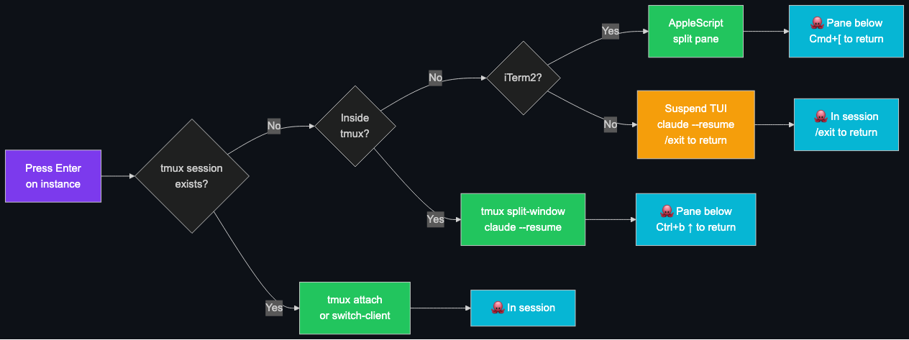
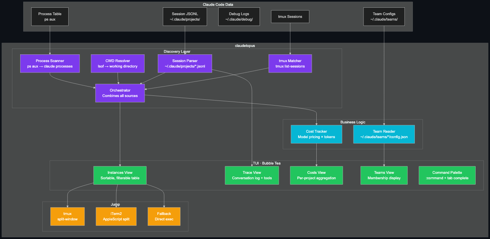
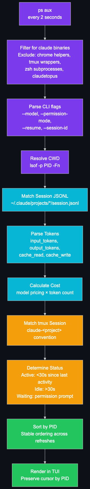

# claudetopus

A k9s-style TUI control plane for managing multiple Claude Code instances.

Like [k9s](https://github.com/derailed/k9s) gives you a dashboard for Kubernetes clusters, claudetopus gives you a dashboard for all your running Claude Code sessions — CLI, VS Code, SDK agents — in one place.

```
┌─ claudetopus ── Instances ──────────── 8 instances (●3 ○4 ◐1)  $4.23 ┐
│                                                                       │
│  PID    STATUS     MODEL        PROJECT          PERM     MEM   COST  │
│  3629   ● Active   opus-4.6     claudetopus      bypass   405M  $0.82 │
│  96297  ● Active   opus-4.6     demoharness      bypass   1.4G  $2.10 │
│  14152  ○ Idle     opus-4.6     excalidraw-mcp   default  128M  $0.45 │
│  3347   ◐ Waiting  opus-4.6     app-interface    plan     108M  $0.31 │
│  97069  ● Active   default      remote-claude    bypass   402M  $0.55 │
│  40662  ○ Idle     default      llama-stack      default  95M   $0.00 │
│  20844  ○ Idle     default      trustyai         bypass   130M  $0.00 │
│  39811  ○ Idle     sonnet-4.5   blog-concept     bypass   146M  $0.00 │
│                                                                       │
├───────────────────────────────────────────────────────────────────────┤
│ :command  j/k:nav  Enter:open pane  l:trace  /:filter  ?:help        │
└───────────────────────────────────────────────────────────────────────┘
```

## Why

If you run multiple Claude Code instances — across terminal tabs, VS Code panels, tmux sessions, SDK agents — you have no unified way to:

- **See what each instance is doing** — which project, what model, is it idle or active?
- **Check the conversation trace** — what did the user ask, what tools were called, what commands ran?
- **Jump into a session** — switch to a running Claude conversation without hunting through tabs
- **Track costs** — how many tokens consumed, estimated spend per session

claudetopus solves all of these from a single terminal.

## Install

```bash
# From source
git clone https://github.com/zanetworker/claudetopus.git
cd claudetopus
make install    # builds and copies to /usr/local/bin

# Or just build locally
make build
./claudetopus
```

**Requirements:** Go 1.24+

## Usage

```bash
claudetopus     # launch the TUI
```

For the best experience, run inside tmux:

```bash
tmux new -s control-plane
claudetopus
```

This enables split-pane session opening — press Enter on any instance and the Claude session opens in a pane below, with claudetopus still visible above.

## Views

### Instances (default)

The main dashboard. Shows all running Claude Code processes with their status, model, project, permission mode, memory usage, and estimated cost.

```
 PID    STATUS     MODEL        PROJECT          PERM     MEM   COST
 3629   ● Active   opus-4.6     claudetopus      bypass   405M  $0.82
 96297  ● Active   opus-4.6     demoharness      bypass   1.4G  $2.10
 14152  ○ Idle     opus-4.6     excalidraw-mcp   default  128M  $0.45
```

**Status indicators:**
- `●` Active — recent conversation activity
- `○` Idle — no activity in the last 30 seconds
- `◐` Waiting — blocked on a permission prompt
- `?` Unknown — process found but no session data

**Instance types detected:**
- **CLI** — terminal sessions (`claude`, `claude --dangerously-skip-permissions`)
- **VSCode** — VS Code extension panels
- **SDK** — remote-claude / Agent SDK processes

### Conversation Trace (`l`)

Press `l` on any instance to see its conversation trace — a chronological view of user prompts, assistant responses, and tool calls.

```
 17:32:28 USER fix the authentication bug in login.go
 17:32:37 ASST I'll look at the login.go file to understand the issue.
 17:32:38 TOOL Read /src/auth/login.go
 17:32:39 TOOL Grep /pattern: handleAuth/
 17:32:41 ASST Found the issue. The token validation is missing...
          ... (truncated)
 17:32:45 TOOL Edit /src/auth/login.go
 17:32:46 TOOL Bash $ go test ./src/auth/ -v
 17:32:50 ASST Fixed. The tests pass now.
```

Tool calls show contextual snippets:
- **Bash** — shows the command (`$ go test ./...`)
- **Read/Write/Edit** — shows the file path
- **Grep** — shows the search pattern
- **Task** — shows the task description

### Costs (`:costs`)

Aggregated token usage and estimated cost per project.

```
 PROJECT              MODEL       TOKENS IN   TOKENS OUT   COST
 demoharness          opus-4.6    245.0K      48.0K        $7.28
 claudetopus          opus-4.6    128.0K      22.0K        $3.57
 app-interface        opus-4.6    45.0K       8.0K         $1.28
 ─────────────────────────────────────────────────────────────
 TOTAL                            418.0K      78.0K        $12.13
```

### Teams (`:teams`)

Shows Claude Code team configurations and their members.

```
 ▸ default (3 members)
   researcher      general-purpose
   implementer     general-purpose
   reviewer        general-purpose

 ▸ api-research (2 members)
   lead            team-lead
   analyst         general-purpose
```

### Help (`?`)

Full keybinding reference.

## Key Bindings

### Navigation

| Key | Action |
|-----|--------|
| `j` / `k` | Move cursor down / up |
| `g` / `G` | Jump to top / bottom |
| `Enter` | Open session (split pane or resume) |
| `l` | View conversation trace |
| `Esc` | Go back |
| `/` | Filter instances |
| `?` | Show help |
| `q` | Quit (from instances view) |

### Trace View

| Key | Action |
|-----|--------|
| `j` / `k` | Scroll line by line |
| `d` / `u` | Page down / page up |
| `g` / `G` | Jump to top / bottom (G = follow latest) |
| `Esc` | Back to instances |

### Commands (press `:`)

| Command | Alias | View |
|---------|-------|------|
| `:instances` | `:i` | Instance list |
| `:logs` | `:l` | Conversation trace |
| `:teams` | `:t` | Teams overview |
| `:costs` | `:c` | Cost dashboard |
| `:help` | `:?` | Help |
| `:quit` | `:q` | Exit |

Tab completion works in the command palette.

## Opening Sessions

When you press `Enter` on an instance, claudetopus opens the Claude session using the best available method:

| Terminal | What happens | Switch back |
|----------|-------------|-------------|
| **tmux** | Split pane below claudetopus | `Ctrl+b ↑` |
| **iTerm2** | Split pane via AppleScript | `Cmd+[` |
| **Other** | Suspends TUI, runs Claude directly | `/exit` returns to claudetopus |

For tmux sessions that already exist (e.g., `claude-myproject`), Enter attaches directly to that session.



## Architecture



### Data Sources

claudetopus reads everything from the filesystem. No daemon, no hooks, no modifications to Claude Code required.

| Source | Location | Data |
|--------|----------|------|
| Process table | `ps aux` | PID, binary path, CLI flags, memory |
| Session logs | `~/.claude/projects/*/` | Messages, tool calls, token usage |
| Debug logs | `~/.claude/debug/` | Plugin loading, MCP connections |
| Teams | `~/.claude/teams/*/config.json` | Team membership |
| Tasks | `~/.claude/tasks/*/` | Task lists, ownership |
| tmux | `tmux list-sessions` | Session names for jump support |

### How Discovery Works



## Cost Tracking

Costs are estimated from token usage in session JSONL files using these rates:

| Model | Input (per 1M) | Output (per 1M) | Cache Read | Cache Write |
|-------|----------------|-----------------|------------|-------------|
| claude-opus-4-6 | $15.00 | $75.00 | $1.50 | $18.75 |
| claude-sonnet-4-5 | $3.00 | $15.00 | $0.30 | $3.75 |
| claude-haiku-3-5 | $0.80 | $4.00 | $0.08 | $1.00 |

## Built With

- [Bubble Tea](https://github.com/charmbracelet/bubbletea) — TUI framework
- [Lip Gloss](https://github.com/charmbracelet/lipgloss) — Styling
- [Bubbles](https://github.com/charmbracelet/bubbles) — TUI components
- [fsnotify](https://github.com/fsnotify/fsnotify) — File watching

## License

MIT
