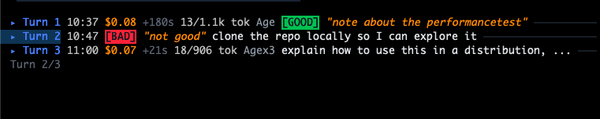
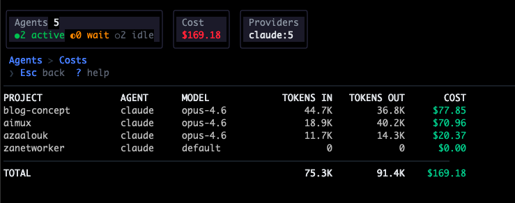

<p align="center">
  
  <br>
  <strong>aimux</strong><br>
  <sub>Tame the agent sprawl.</sub>
  <br><br>
  <sub>See all your agents. Trace what they did. Judge if it was good.</sub>
</p>

<p align="center">
  <a href="https://github.com/zanetworker/aimux/releases/latest"></a>
  
  
  <a href="https://zanetworker.github.io/aimux/"></a>
</p>

<p align="center">
  
</p>

One agent just silently deleted your auth config. Another rewrote 47 files. aimux shows you exactly what happened, and lets you judge if it was good.

## Quick Start

```bash
brew install zanetworker/aimux/aimux
aimux          # terminal dashboard
aimux web      # browser dashboard at localhost:9090
```

Requires **tmux**. Auto-discovers running Claude and Codex agents.

## What It Does

**See everything.** Live trace of every prompt, response, and tool call as agents work. Watch file edits, bash commands, and API calls turn by turn.

**Judge quality.** Label turns GOOD, BAD, or WASTE. Add notes. Build eval datasets from real production sessions, not synthetic benchmarks.

**Export anywhere.** OTEL to MLflow or Jaeger for evaluation pipelines. JSONL to disk for offline analysis. Your annotations become feedback assessments.

**Zero setup.** No config, no instrumentation, no SDK. Run `aimux` and it finds every running agent on your machine.

## Features

<table>
<tr>
<td width="50%">

**Discovery & Monitoring**
- Auto-discovers Claude and Codex agents
- Live status: active, idle, waiting, error
- Per-agent CPU%, memory, token usage, and cost tracking
- Model-aware pricing (Opus, Sonnet, Haiku, GPT)
- Cross-session search ("which agent edited auth.go?")

</td>
<td width="50%">

**Tracing & Code Review**
- Turn-by-turn trace of prompts, responses, tool calls
- PR-style diff review panel with file tree hierarchy
- Inline diffs for Edit/Write tool calls with syntax coloring
- Live diff pane alongside session terminal (auto-refreshes)
- Annotate turns as GOOD / BAD / WASTE with notes
- Export to MLflow, Jaeger, or any OTLP backend

</td>
</tr>
<tr>
<td>

**Two Interfaces**
- **TUI**: keyboard-driven, split-pane trace + live session
- **Web**: card grid, filtering, session history, trace + diff panels
- Dark and light themes (web dashboard)
- Plugin system for custom dashboard tabs

</td>
<td>

**Agent Management**
- Launch and spawn agents from CLI or UI
- Star/pin sessions to find them later across restarts
- Profiles: save named flag bundles for repeated use
- Session history with browse, search, path filter, and resume
- LLM-powered title generation for untitled sessions
- Kubernetes support: run agents on K8s pods

</td>
</tr>
</table>

<p align="center">
  
  
</p>

## Agent-Ready CLI

aimux is built for AI agents. Every command supports `--json` for structured output, errors include valid values, and `agent-context` dumps the full CLI contract.

```bash
aimux agents --json                              # discover running agents
aimux sessions --list --json --limit 5           # search past sessions
aimux spawn claude --dir ./proj --wait --json    # start and wait for completion
aimux agent-context                              # full CLI schema for agents
aimux profile save work --provider claude        # save reusable config
aimux feedback "the X flag doesn't work"         # report friction
```

See [Agent Usage](https://zanetworker.github.io/aimux/guides/agent-usage/) for the full guide and [SKILL.md](SKILL.md) for agent workflow recipes.

## Documentation

Full documentation at **[zanetworker.github.io/aimux](https://zanetworker.github.io/aimux/)**

- [Getting Started](https://zanetworker.github.io/aimux/getting-started/) - install, first run, CLI commands
- [Configuration](https://zanetworker.github.io/aimux/configuration/) - full config.yaml reference
- [Agent Usage](https://zanetworker.github.io/aimux/guides/agent-usage/) - structured output, profiles, feedback
- [Web Dashboard](https://zanetworker.github.io/aimux/guides/web-dashboard/) - cards, filters, sessions, diff review
- [TUI Keybindings](https://zanetworker.github.io/aimux/guides/tui-keybindings/) - keyboard shortcuts
- [Tracing & Annotations](https://zanetworker.github.io/aimux/guides/tracing/) - trace view, OTEL, JSONL
- [Launch Modes](https://zanetworker.github.io/aimux/guides/launch-modes/) - tmux, direct, task-driven
- [Adding a Provider](https://zanetworker.github.io/aimux/advanced/adding-a-provider/) - extend with new agents
- [Kubernetes](https://zanetworker.github.io/aimux/advanced/k8s-quickstart/) - run agents on K8s

## Built With

[Bubble Tea](https://github.com/charmbracelet/bubbletea) |
[Lip Gloss](https://github.com/charmbracelet/lipgloss) |
[charmbracelet/x/vt](https://github.com/charmbracelet/x) |
[creack/pty](https://github.com/creack/pty) |
[OpenTelemetry](https://opentelemetry.io/) |
[Starlight](https://starlight.astro.build/)

## License

[MIT](LICENSE)
