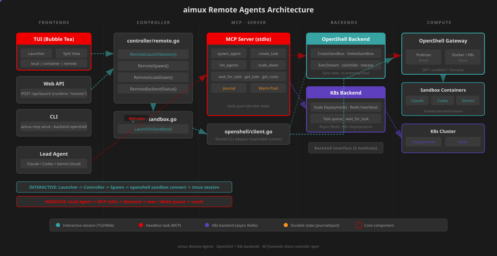
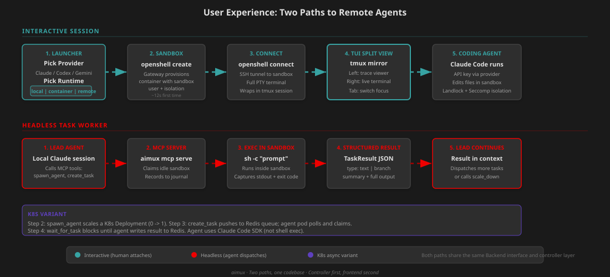

# Remote Agents

aimux runs AI coding agents on remote infrastructure: isolated OpenShell sandboxes or Kubernetes pods. Two use cases, one codebase.

**Interactive sessions**: A human picks "remote" in the TUI launcher, aimux creates a sandbox, opens a terminal via tmux, and the user works with Claude/Codex/Gemini inside the sandbox as if it were local.

**Headless task workers**: A lead agent (running locally) dispatches coding tasks to remote workers via MCP tools. Workers execute the task, return structured results, and the lead continues.



## Two Backends

| | OpenShell | K8s |
|-|-----------|-----|
| **Compute** | NVIDIA OpenShell sandboxes (podman/docker/k8s) | Kubernetes Deployments |
| **Task dispatch** | `exec` into sandbox (synchronous) | Redis queue (async) |
| **State** | In-memory pool + JSONL journal | Redis |
| **Isolation** | Landlock + Seccomp + network namespace | Pod-level |
| **Best for** | Dev, single-machine, podman | Multi-node clusters |

Both implement the same `Backend` interface (5 methods), so all MCP tools and controller functions work identically.

## UX Flow



### Interactive Session (human attaches)

1. **Launcher**: User presses `n` in the TUI, picks a provider (Claude/Codex/Gemini), and selects Runtime: **remote**
2. **Sandbox creation**: `controller.RemoteLaunchSession()` calls `spawn.LaunchInSandbox()`, which calls `runtime.OpenShellRuntime.Create()`. The shared `openshell.Client` starts `openshell sandbox create` in the background, reads the sandbox name from stdout, polls `openshell sandbox list` until the sandbox reaches Ready phase (~12s first time, faster with warm pool)
3. **Terminal connect**: A tmux session is created running `openshell sandbox connect <name>`, which opens an SSH tunnel to the sandbox. The user gets a full PTY terminal
4. **TUI split view**: The TUI mirrors the tmux session on the right pane (same pattern as local Codex/Gemini). Left pane shows trace viewer. Tab switches focus
5. **Agent runs**: Claude Code (or Codex/Gemini) runs inside the sandbox with API credentials injected via `openshell provider`. The sandbox has Landlock + Seccomp isolation, network namespacing, and a dedicated workspace at `/sandbox/`

### Headless Task Worker (agent dispatches)

**OpenShell path:**
1. Lead agent calls `spawn_agent` via MCP -> creates sandbox, tracked in in-memory pool
2. Lead calls `create_task` with a prompt -> server claims an idle sandbox via `claimIdle()`, execs `sh -c "<prompt>"` inside it, captures stdout + exit code, releases sandbox back to pool
3. Result returned immediately as structured JSON. Journal records state transitions
4. Lead calls `scale_down` when done -> all sandboxes deleted

**K8s path:**
1. Lead calls `spawn_agent` -> scales a Deployment from 0 to 1, polls Redis until agent registers heartbeat
2. Lead calls `create_task` -> pushes task to Redis sorted set, returns task ID
3. Agent pod polls Redis, claims task, runs prompt via `claude-code-sdk`, writes result to Redis
4. Lead calls `wait_for_task` -> polls Redis until status is `completed`/`failed`, returns result
5. Lead calls `scale_down` -> `deploymentNameFromPod()` extracts Deployment name, scales to 0

## Architecture

### Package Layout

```
internal/
  openshell/                  Shared CLI adapter
    client.go                 CommandRunner, CreateSandbox, Exec, Delete, List, Status
                              Injectable runner for tests, ANSI stripping, background create
    client_test.go            17 unit tests
    client_integration_test.go 4 integration tests (real gateway)

  mcpserver/                  MCP server and backends
    backend.go                Backend interface (5 methods)
    backend_openshell.go      OpenShell: delegates to shared client, in-memory pool
    backend_k8s.go            K8s: Redis heartbeats, Deployment scaling, deploymentNameFromPod
    server.go                 11 MCP tool handlers, backend switching, nil guards
    journal.go                Append-only JSONL task journal, replay on startup
    pool.go                   Warm pool: WarmUp() on startup, EnsureCapacity() before dispatch
    result.go                 TaskResult struct (text or branch type)

  controller/                 UI-agnostic business logic
    remote.go                 RemoteLaunchSession, RemoteSpawn, RemoteScaleDown, RemoteBackendStatus

  discovery/
    sandbox.go                DiscoverSandboxes() polls openshell sandbox list (3s timeout)
    sandbox_test.go           Parsing tests with ANSI, empty, Ready/Error phases

  runtime/
    openshell.go              Create/Delete/Status/Attach/ConnectCommand via shared client

  spawn/
    sandbox.go                LaunchInSandbox: create sandbox + tmux "openshell sandbox connect"

  config/
    config.go                 RemoteConfig: backend, gateway, image, warm_pool
```

### Shared OpenShell Client

`internal/openshell/client.go` wraps the `openshell` CLI. Both `runtime/openshell.go` and `mcpserver/backend_openshell.go` use it, preventing duplication.

Design decisions:

- **Injectable `CommandRunner`**: `func(ctx, name, args...) (stdout, exitCode, error)`. Tests inject fakes; real implementation uses `exec.CommandContext`. The `isDefaultRunner` flag switches `CreateSandbox` between the synchronous test path and the real background-pipe path
- **Error wrapping with `%w`**: Preserves `exec.ExitError` so callers can extract exit codes via `errors.As`
- **ANSI stripping**: The real CLI outputs escape codes in all output. `stripAnsi()` removes them before parsing. Without this, `parseSandboxName` and `parseSandboxList` fail
- **Background create with pipe**: `openshell sandbox create` blocks after printing the name. The client starts the process, reads the name from a stdout pipe via a goroutine, polls `sandbox list` for "Ready", then kills the blocking process (sandbox stays alive)
- **CLI syntax (verified v0.0.66)**: `exec -n <name>` (not positional), `create --name <name> --from <image>`, `list` returns `NAME DATE TIME PHASE` (status is last field)

### Backend Interface

```go
type Backend interface {
    CreateSandbox(ctx, SandboxOpts) (name, error)
    DeleteSandbox(ctx, name) error
    ListSandboxes(ctx) ([]SandboxStatus, error)
    ExecStream(ctx, name, command) (ExecResult, error)
    IdleCount(ctx) (int, error)
}
```

**OpenShellBackend**: Delegates to shared client. Pool tracking with `claimIdle()`/`release()`. ExecStream marks sandbox busy during execution, idle after.

**K8sBackend**: Redis heartbeats for discovery, Deployment scaling for lifecycle. `DeleteSandbox` uses `deploymentNameFromPod()` to strip ReplicaSet + pod hash suffixes (e.g., `agent-claude-coder-78564fdf75-4rxlk` -> `agent-claude-coder`). `ExecStream` returns error (K8s uses Redis queues). Exposes `Redis()` and `TeamID()` for task handlers.

### Task Dispatch

**OpenShell** (`createTaskExec`): synchronous. Claims idle sandbox, execs `sh -c <prompt>`, captures output, releases sandbox, returns result with structured `TaskResult` JSON. Records events to journal.

**K8s** (`createTaskRedis`): asynchronous. Writes task to Redis hash, adds to pending sorted set, returns task ID. Worker polls Redis, claims, executes via `claude-code-sdk`, writes result back.

Tools that only work on K8s (`list_tasks`, `get_task`, `wait_for_task`, `send_message`, `get_costs`) return informational messages on OpenShell.

### Task Journal

`~/.aimux/tasks.jsonl`. Append-only, replays on startup:

```json
{"task_id":"t-1","state":"created","prompt":"fix auth bug","ts":"2026-06-20T19:00:00Z"}
{"task_id":"t-1","state":"running","sandbox":"sb-abc","ts":"2026-06-20T19:00:05Z"}
{"task_id":"t-1","state":"done","result":"...","ts":"2026-06-20T19:05:00Z"}
```

### Warm Pool

`--warm-pool 2` pre-creates 2 sandboxes on MCP server startup. `spawn_agent` returns instantly instead of waiting ~12s for provisioning. Sandboxes labeled `aimux-pool=warm`.

### Controller Layer (frontend-agnostic)

All business logic lives in `controller/remote.go`. Every frontend calls these same functions:

| Function | TUI wiring | Web API wiring | CLI wiring |
|----------|-----------|----------------|------------|
| `RemoteLaunchSession()` | Launcher "remote" -> split view | `POST /api/launch {runtime:"remote"}` | N/A |
| `RemoteSpawn()` | N/A (MCP path) | N/A (MCP path) | `aimux mcp serve` |
| `RemoteScaleDown()` | N/A (MCP path) | N/A (MCP path) | `aimux mcp serve` |
| `RemoteBackendStatus()` | Agent list status | `GET /api/health` (TODO) | `aimux status` (TODO) |

### Frontend Wiring

**TUI** (`app.go`):
- `LaunchMsg{Runtime: "remote"}` -> `spawn.LaunchInSandbox()` -> opens split view with tmux mirror
- Agent appears in agent list immediately as `pendingAgent`
- Trace pane starts empty (remote session files not yet streamed)

**Web API** (`main.go` + `handlers.go`):
- `SetLaunchFunc` handler checks `opts.Runtime == "remote"` -> calls `spawn.LaunchInSandbox()`
- Response includes `sandbox_name` field
- Same controller function as TUI

**CLI**:
- `aimux mcp serve --backend openshell --gateway http://...` starts MCP server
- `aimux mcp serve --warm-pool 2` pre-creates sandboxes
- `aimux mcp register` writes to `~/.claude/settings.json`

## MCP Tools

| Tool | OpenShell | K8s |
|------|-----------|-----|
| `spawn_agent` | Creates sandbox via CLI | Scales Deployment |
| `create_task` | Exec in sandbox (sync) | Push to Redis (async) |
| `list_agents` | Lists sandboxes | Lists Redis heartbeats |
| `scale_down` | Deletes all sandboxes | Scales Deployment to 0 |
| `list_tasks` | N/A (sync) | Lists Redis tasks |
| `get_task` | N/A (sync) | Gets Redis task hash |
| `get_task_result` | N/A (sync) | Gets Redis full result |
| `wait_for_task` | N/A (sync) | Polls Redis |
| `send_message` | N/A | Redis stream |
| `get_costs` | N/A | Redis cost hashes |
| `cleanup_branches` | GitHub API | GitHub API |

## Configuration

```yaml
# ~/.aimux/config.yaml
remote:
  backend: openshell
  gateway: "http://127.0.0.1:8090"
  image: "ghcr.io/nvidia/openshell-community/sandboxes/base:latest"
  warm_pool: 3

kubernetes:
  enabled: true
  redis_url: "redis://:pass@redis-host:6379"
  namespace: "agents"
  team_id: "my-team"
  kubeconfig: "/path/to/kubeconfig"  # required; KUBECONFIG env var not auto-detected
```

## Discovery

Remote sandboxes appear in the TUI agent list automatically. `DiscoverSandboxes()` runs on each discovery tick (alongside local process scanning) and calls `openshell sandbox list` with a 3-second timeout. If the gateway is unreachable or the CLI isn't installed, it returns nil without blocking local discovery.

Sandboxes show with:
- **LOC** column: `remote` (uses `agent.Location` field, falls back to heuristic for local/k8s)
- **NAME**: sandbox name from OpenShell (e.g., `happy-fox`)
- **STATUS**: Active (Ready phase), Error, or Idle

Deduplication: sandboxes already tracked as pending agents (from `LaunchInSandbox`) are skipped based on `SandboxName` match.

## OTEL Trace Forwarding

OTEL env vars are injected via `--env` flags at sandbox creation time. Claude Code's Node.js process inherits them from the container environment. The endpoint is rewritten from `localhost` to `host.openshell.internal` so traces cross the sandbox network boundary via OpenShell's bridge (available since [PR #1279](https://github.com/NVIDIA/OpenShell/pull/1279)).

`LaunchInSandbox` passes:
```
--env OTEL_EXPORTER_OTLP_ENDPOINT=http://host.openshell.internal:<port>
--env OTEL_EXPORTER_OTLP_PROTOCOL=http/protobuf
--env OTEL_EXPORTER_OTLP_LOGS_ENDPOINT=http://host.openshell.internal:<port>/v1/logs
```

The port is extracted from the host OTEL receiver config (default 4318). OTEL is always enabled for remote sessions since file-based tracing is not available (no local session JSONL file).

Note: we originally thought `--env` vars didn't reach provider-started processes (BUG-2 in early testing). This was a false alarm: `/proc/1/environ` is root-owned and unreadable by the sandbox user, so our test incorrectly reported the var as missing. Verified via `/proc/<claude-pid>/environ` that all three OTEL vars are present in Claude's process.

## Gateway Setup (OpenShell + Podman on macOS)

### Prerequisites

```bash
# Install OpenShell v0.0.66+
curl -fsSL https://raw.githubusercontent.com/NVIDIA/OpenShell/main/install.sh | sh
openshell --version   # 0.0.66+

# Ensure podman machine is running
podman machine start
```

### Start Gateway

The install script creates `~/.config/openshell/gateway-podman.toml` and JWT keys at `~/.config/openshell/jwt/`. Start natively (not in a container):

```bash
OPENSHELL_PODMAN_SOCKET=$(podman machine inspect --format '{{.ConnectionInfo.PodmanSocket.Path}}') \
  openshell-gateway \
  --config ~/.config/openshell/gateway-podman.toml \
  --db-url "sqlite:$HOME/.config/openshell/gateway-podman.db?mode=rwc"
```

### Register API Provider

```bash
# For Claude Code inside sandboxes
openshell provider create --name claude --type claude-code \
  --credential ANTHROPIC_API_KEY=sk-ant-...
```

### Verify

```bash
openshell status                                    # Connected v0.0.66
openshell sandbox create --no-keep -- echo "hello"  # prints hello
```

### Gateway Config Requirements

```toml
[openshell.gateway]
compute_drivers = ["podman"]    # NOT ["docker"]
disable_tls     = true

[openshell.gateway.auth]
allow_unauthenticated_users = true    # dev only; production uses mTLS

[openshell.gateway.gateway_jwt]
signing_key_path = "~/.config/openshell/jwt/signing.pem"
public_key_path  = "~/.config/openshell/jwt/public.pem"
kid_path         = "~/.config/openshell/jwt/kid.txt"
```

### Known Gotchas

| Issue | Cause | Fix |
|-------|-------|-----|
| Sandbox crash: "no sandbox token source" | Gateway JWT not configured | Add `[openshell.gateway.gateway_jwt]` section with Ed25519 keys |
| CLI: "missing authorization header" | `gateway_jwt` enabled without `allow_unauthenticated_users` | Add `[openshell.gateway.auth] allow_unauthenticated_users = true` |
| `image_pull_policy = "IfNotPresent"` rejected | Podman driver uses `missing`, not Docker syntax | Change to `"missing"` |
| Gateway in container: permission denied on socket | Rootless podman UID remapping | Run gateway natively, or use `--userns keep-id --security-opt label=disable` |
| `sandbox exec` "command not found" | Positional syntax `exec <name>` wrong | Use `exec -n <name> -- <command>` |
| Exec rejects newlines in args | OpenShell security: no newlines in command args | Use single-line commands; write multi-line scripts to files first |
| `ANTROPIC_API_KEY` (missing H) | OpenShell provider env var naming bug | Workaround: `export ANTHROPIC_API_KEY=$ANTROPIC_API_KEY` in sandbox |
| K8s `scale_down` "Deployment not found" | Pod name used as Deployment name | Fixed: `deploymentNameFromPod()` strips hash suffixes |
| K8s backend "no configuration provided" | `KUBECONFIG` env var not auto-detected | Pass `--kubeconfig ~/.kube/config` explicitly |

## Verified Test Results

### OpenShell Backend (local podman gateway v0.0.66)

| Test | Result |
|------|--------|
| Gateway status | PASS |
| `spawn_agent` (real sandbox) | PASS |
| `create_task` (fibonacci via Claude Code SDK) | PASS (`Hello, World!`, `MATH_TEST_PASSED`) |
| `create_task` (system info) | PASS (Linux aarch64, Python 3.13.12) |
| `create_task` (exit code 42) | PASS (failed correctly) |
| Warm pool (`--warm-pool 2`) | PASS (2 sandboxes pre-created) |
| Task journal | PASS (4 tasks, 12 events persisted) |
| Interactive session (tmux + Claude Code) | PASS (`claude -p "2+2"` -> `4`) |
| `aimux mcp register` | PASS (written to settings.json) |
| Sandbox isolation | PASS (two sandboxes can't read each other's files) |
| Integration tests | 4 client + 4 backend + 1 controller = 9 PASS |
| Unit tests | 70+ across all packages |

### K8s Backend (workload cluster)

| Test | Result |
|------|--------|
| `list_agents` (Redis heartbeats) | PASS |
| `list_tasks` (Redis query) | PASS |
| `spawn_agent` (Deployment 0->1) | PASS |
| `create_task` (Claude Code SDK, fibonacci) | PASS (`55` correct) |
| `wait_for_task` (blocking poll) | PASS (`WAIT_TEST_OK`) |
| `get_task` / `get_task_result` | PASS (full details + output) |
| `scale_down` (Deployment 1->0) | PASS |

## Testing

```bash
# Unit tests (no gateway needed)
go test ./internal/openshell/ ./internal/mcpserver/ ./internal/controller/ \
  ./internal/runtime/ ./internal/spawn/ -timeout 30s

# Integration tests (requires running gateway)
go test ./internal/openshell/ -tags integration -timeout 180s -v
go test ./internal/mcpserver/ -tags integration -timeout 180s -v
go test ./internal/controller/ -tags integration -timeout 180s -v

# Full project
go test ./... -timeout 30s
```
